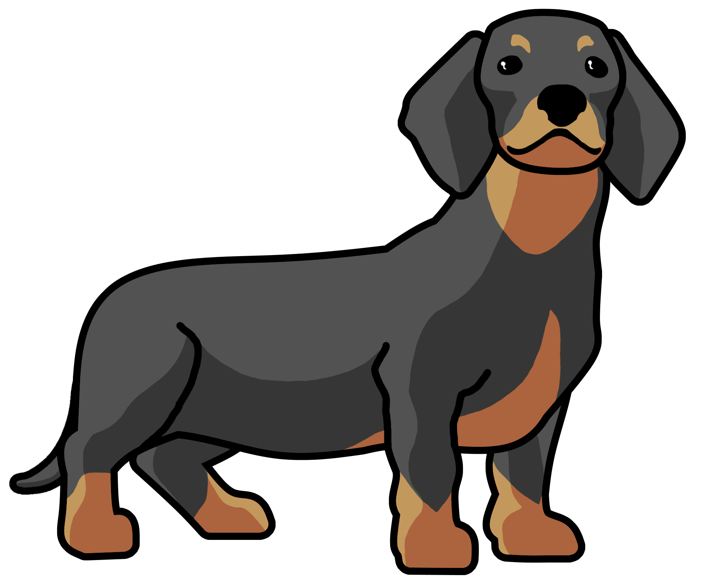

    
    <h1>
        Dog
    </h1>
	<h4>
        <code>dog</code>, an alternative to <code>cat</code>,
         
        but with syntax highlighting
    </h4>

# About

Have you ever wished that the cat command would pretty print, make proper syntax highlighting for code and be easily customizable?
Well, that's why Dog was made!

We aim to be a better alternative to the boring old cat program, make your life happier and fill your terminal with colors and joy! 

## Inspiration

This project is not original, and takes inspiration from a set of different other sources. Some of which are:

* https://pygments.org/
* https://github.com/sharkdp/bat
* https://github.com/garabik/grc
* https://github.com/owenthereal/ccat
* https://www.tecmint.com/bat-a-cat-clone-with-syntax-highlighting/

